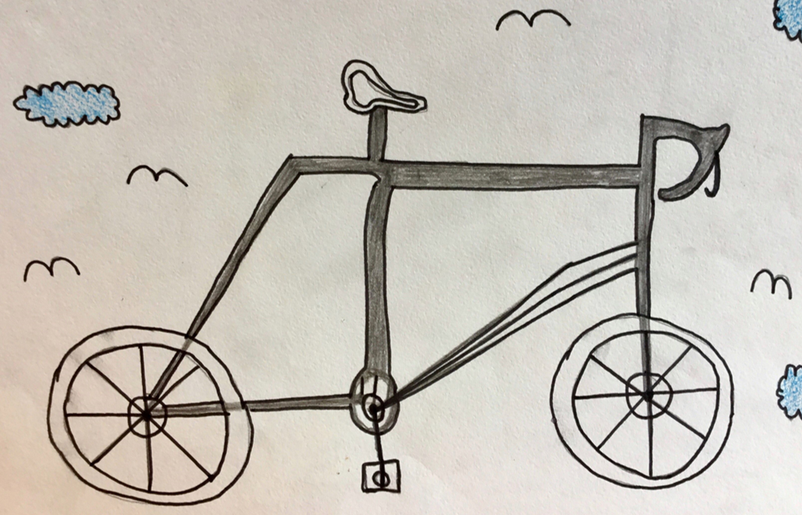

# Storytelling

# Copying
## how to use inexperience to your advantage

We are by nature averse to copying, it's childish behavior.
even when someone starts to behave like we do, we immediatly dislike it, are almost repulsed by the awkwardness of it.

But for any idea to be of merit it has to be understandable, make sense within the established system.
FOr example when creating your personal image and deciding how youre going to dress you would like the acknowlegment for being original and invenive, but step too far outside the trends, what is popular and it will be more difficult for your ideas to be understood and appreciated.

So the most praised ideas are often just slight variations on what we are already familiar with as those ideas lend themselves to being understood to greatest depth by the broadest audience.

Arriving at something new through imitation

I like the exaplme of childrens drawings

 
   
A childrens drawing of a bike - Me or You would be able to draw it more accurately to reality, this drawing isn't really what a bike looks like, but maybe it's more interesting it's new.
And the child can do it - create something new - without trying. Maybe we can try and set similar conditions for us, to get to this accidental creation.
Recreating something from an incomplete recall of memory or without proper resources. Allowing for mistakes to be made easily.

Setting out to make something new is difficult but letting it happen might be easier

In my personal experience i come across this often in my hobbies
